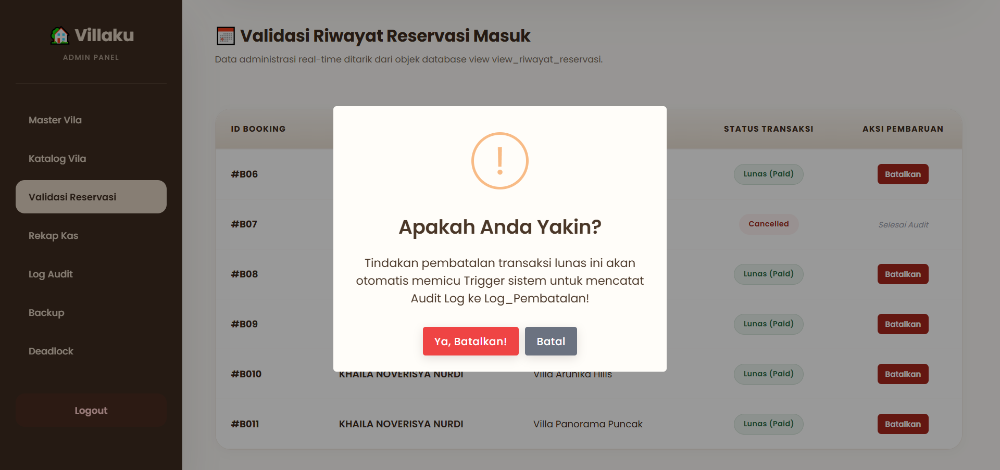
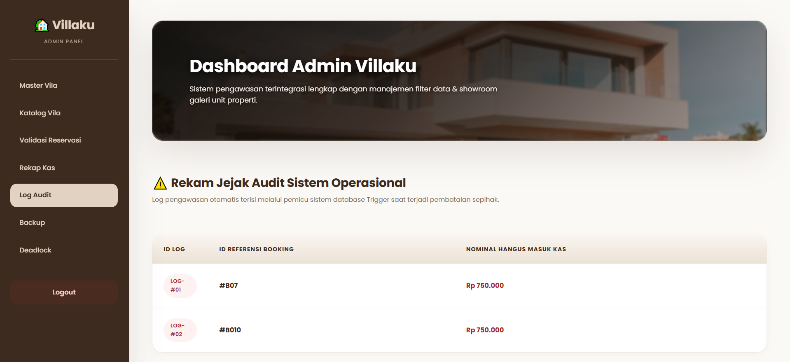
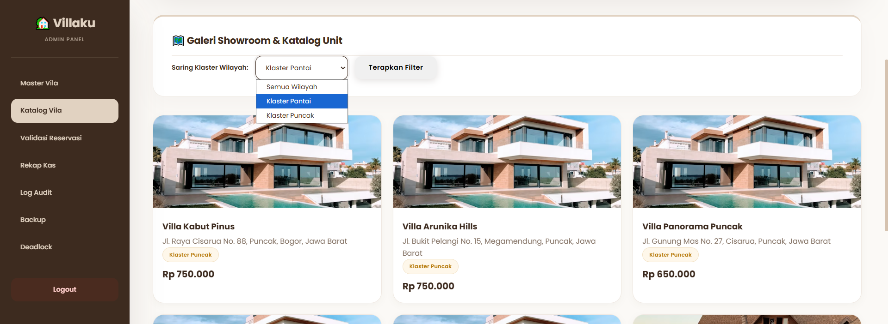
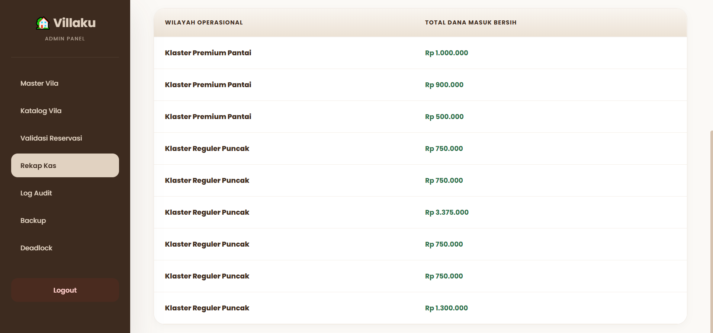
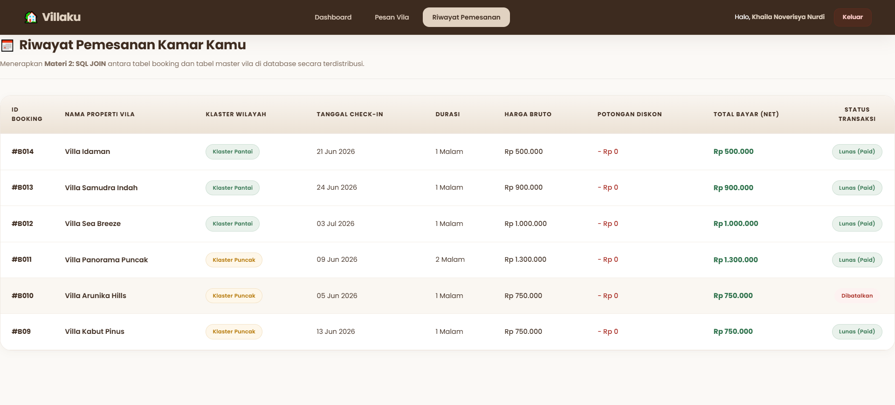
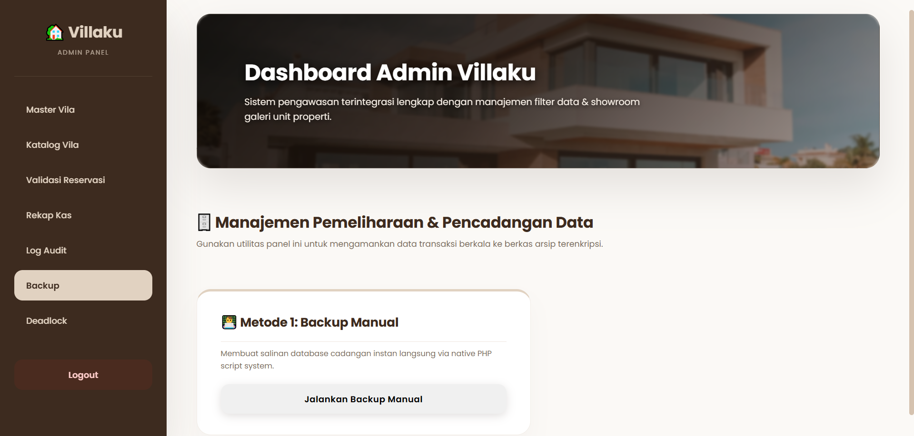

# 🏡 Villaku - Sistem Reservasi dan Manajemen Vila (Proyek UAP)

Villaku merupakan aplikasi reservasi vila berbasis web yang dibangun menggunakan **PHP** dan **MySQL**. Sistem ini menerapkan beberapa materi Basis Data Lanjut seperti **Trigger**, **Fragmentasi Data**, serta **Backup Database dan Task Scheduler** untuk mendukung keamanan, integritas, dan pengelolaan data secara efisien.

---

# 🔔 Penerapan Trigger

Pada sistem **Villaku**, trigger digunakan untuk melakukan pencatatan audit secara otomatis ketika terjadi pembatalan reservasi yang sebelumnya telah berstatus **Paid**. Dengan adanya trigger, seluruh aktivitas pembatalan transaksi dapat tercatat secara otomatis tanpa perlu menambahkan logika tambahan pada aplikasi PHP.



### Implementasi Trigger

```sql
BEGIN
    IF OLD.status_booking = 'Paid' AND NEW.status_booking = 'Cancelled' THEN
        INSERT INTO log_pembatalan (
            id_booking,
            nama_customer,
            nominal_hangus,
            tgl_pencatatan
        )
        VALUES (
            OLD.id_booking,
            (SELECT nama
             FROM customer
             WHERE id_customer = OLD.id_customer
             LIMIT 1),
            OLD.total_bayar_bersih,
            NOW()
        );
    END IF;
END
```

### Pemanggilan pada Sistem

Trigger akan aktif secara otomatis ketika admin membatalkan transaksi yang sebelumnya telah disahkan melalui halaman **Validasi Reservasi**.

**File:** `admin_reservasi.php`

```php
<?php if (($r['status_booking'] ?? '') === 'Pending'): ?>
    <a href="?action_status=Paid&id_b=<?= $r['id_booking'] ?>">
        Sahkan Pembayaran
    </a>
<?php else: ?>
    <a href="?action_status=Pending&id_b=<?= $r['id_booking'] ?>">
        Batalkan Sewa
    </a>
<?php endif; ?>
```



---

# 🧩 Penerapan Fragmentasi Horizontal

Fragmentasi horizontal digunakan untuk memisahkan data vila berdasarkan wilayah operasional sehingga proses pengelolaan dan pencarian data menjadi lebih terstruktur. Pada sistem ini, data vila dipisahkan menjadi klaster **Pantai** dan **Puncak** menggunakan database view.



### Implementasi Fragmentasi Horizontal

```sql
SELECT
    id_vila,
    nama_vila,
    alamat,
    harga_per_malam,
    status
FROM vila
WHERE klaster = 'Pantai'
AND status = 'Tersedia';
```

### Pemanggilan pada Sistem

**File:** `admin_pantai.php`

```php
renderVilaTable(
    $pdo,
    'view_vila_pantai_aktif',
    'Katalog Khusus Wilayah Vila Pantai (Aktif)'
);

renderVilaTable(
    $pdo,
    'view_vila_puncak_aktif',
    'Katalog Khusus Wilayah Vila Puncak (Aktif)'
);
```

View tersebut digunakan untuk menampilkan katalog vila aktif berdasarkan wilayah sehingga data dapat dikelola dan ditampilkan secara terpisah.

---

# 🗂️ Penerapan Fragmentasi Vertikal

Fragmentasi vertikal digunakan untuk menyajikan atribut tertentu yang dibutuhkan pada proses rekapitulasi transaksi. Pada sistem Villaku, data transaksi dipisahkan dan dikelompokkan berdasarkan wilayah operasional sehingga proses monitoring pendapatan menjadi lebih mudah dilakukan.



### Implementasi Fragmentasi Vertikal

```sql
SELECT
    booking.id_booking,
    booking.total_bayar_bersih,
    'Klaster Premium Pantai' AS wilayah_operasional
FROM booking
WHERE id_vila IN (
    SELECT id_vila
    FROM vila
    WHERE klaster = 'Pantai'
)

UNION ALL

SELECT
    booking.id_booking,
    booking.total_bayar_bersih,
    'Klaster Reguler Puncak' AS wilayah_operasional
FROM booking
WHERE id_vila IN (
    SELECT id_vila
    FROM vila
    WHERE klaster = 'Puncak'
);
```

### Pemanggilan pada Sistem

View rekap wilayah digunakan pada halaman **Rekap Kas** untuk menampilkan data transaksi berdasarkan wilayah operasional vila.

---

# 🔀 Penerapan Fragmentasi Hybrid

Fragmentasi hybrid merupakan kombinasi antara fragmentasi horizontal dan fragmentasi vertikal. Pada sistem Villaku, data reservasi tidak hanya dipisahkan berdasarkan wilayah operasional, tetapi juga disajikan menggunakan atribut tertentu yang dibutuhkan oleh pengguna.



### Implementasi Fragmentasi Hybrid

Fragmentasi hybrid memanfaatkan data hasil pemisahan wilayah operasional serta atribut transaksi yang relevan untuk ditampilkan pada halaman riwayat pemesanan pelanggan.

### Pemanggilan pada Sistem

**File:** `customer_riwayat.php`

Data yang ditampilkan pada halaman riwayat pemesanan berasal dari hasil penggabungan beberapa objek database yang telah difragmentasi sehingga informasi yang diterima pengguna menjadi lebih spesifik dan efisien.

---

# 💾 Penerapan Backup Database + Task Scheduler

Untuk menjaga keamanan dan ketersediaan data, sistem Villaku menyediakan fitur backup database secara manual maupun otomatis. Backup manual dapat dijalankan langsung melalui panel admin, sedangkan backup otomatis dijalankan menggunakan Windows Task Scheduler yang memanggil file batch secara berkala.



### Implementasi Backup Manual

**File:** `admin_backup.php`

```php
if (isset($_POST['btn_backup'])) {

    $folder_target = __DIR__ . '/backup/';

    $nama_file = 'backup_manual_' . date('Y-m-d_H-i') . '.sql';

    $tables = [
        'customer',
        'users',
        'vila',
        'booking',
        'log_pembatalan'
    ];

    file_put_contents($path_lengkap, $sql);
}
```

### Implementasi Backup Otomatis

**File:** `mysqlbackup.bat`

```bat
@echo off
setlocal enabledelayedexpansion

c:

set "backupDir=C:\laragon\www\BOOKINGVILLA_UAP_PDT\backup"
set "mysqlDir=C:\laragon\bin\mysql\mysql-8.0.30-winx64\bin"

cd /d "%mysqlDir%"

for /f "tokens=2 delims==" %%I in ('wmic os get localdatetime /value') do set "dt=%%I"
set "year=!dt:~0,4!"
set "month=!dt:~4,2!"
set "day=!dt:~6,2!"
set "hour=!dt:~8,2!"
set "minute=!dt:~10,2!"
set "timestamp=!year!-!month!-!day!_!hour!-!minute!"

mysqldump.exe -u adm_backup_booking_villa -payamgoreng.4 uap_villa > "%backupDir%\backup_otomatis_%timestamp%.sql"

endlocal
```

Backup otomatis dijalankan menggunakan **Windows Task Scheduler** dan menghasilkan file cadangan database dengan format:

```text
backup_otomatis_YYYY-MM-DD_HH-MM.sql
```

Seluruh file backup disimpan pada folder:

```text
/backup
```

sehingga dapat digunakan kembali apabila terjadi kehilangan atau kerusakan data.
